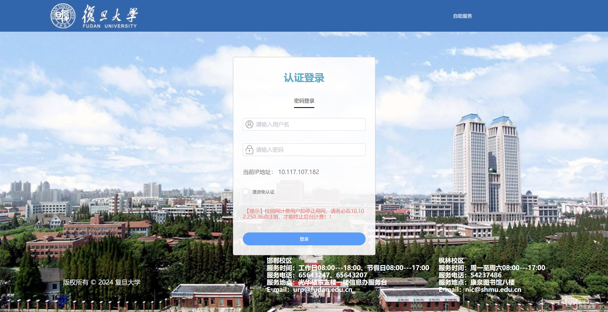
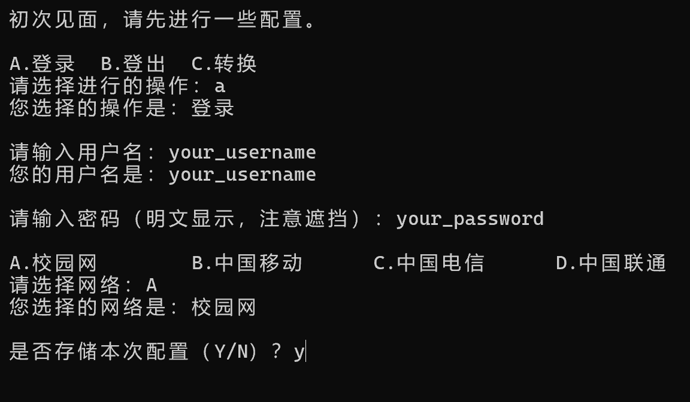

# Fudan Dormitory Network Verify

 [view this project on GitHub](https://github.com/Jerry-Wu-GitHub/fudan-dormitory-network-verify) 

---

## Introduction

This is the webpage of Fudan Dormitory Network:

这是复旦宿舍网的网页：



This project analyzes requests related to login and logout, encapsulates them, and enables the use of command-line tools for automated login and logout of Fudan Dormitory Network.

本项目解析了与登录、登出有关的请求，对其进行封装，并使得可以使用命令行工具来进行自动化的登录、登出复旦宿舍网。

---

# Use

1. Install Python.

    安装 Python 。

2. Download the code of this project.

    下载本项目的代码。

### Method 1: Run directly.

3. Run `main.py`.

    运行 `main.py` 。

4. When using it for the first time, some configurations need to be entered. If you choose to remember this configuration in the end, it will run according to this configuration in the future.

    初次使用时需要输入一些配置。如果最后选择存储本次配置，则以后会按照本次的配置来运行。

    

5. After storing the initial configuration, a `/config/user.py` file will be automatically generated. You can edit this file to modify the configuration.

    在存储初次配置后，会自动生成 `/config/user.py` 文件。您可以编辑该文件来修改配置。

### Method 2: Use command-line tools.

3. Open the command-line tool and enter the root directory of this project.

    打开命令行工具，进入到本项目根目录。

    ```console
    cd /D "path/to/project/fudan-dormitory-network-verify"
    ```

4. Enter the command and execute it.

    输入命令并执行。

    #### Syntax

    ```console
    python main.py action username password channel
    ```

    #### Param

    - `action` : the default behavior when running the program, which can be one of the following three:
        - `login`
        - `logout`
        - `shift` : If you are currently logged in, you will be logged out; If you are currently logged out, a login will be performed.

    - `username` : the content filled in the "请输入用户名" box on the webpage of Fudan Dormitory Network.

    - `password` : the content filled in the "请输入密码" box.

    - `channel` : the option to be selected on the "选择网络" panel, which can be one of the following four:
        - `校园网`
            - `中国移动`
            - `中国电信`
            - `中国联通`

    #### Example

    ```console
    python main.py login 123456 abcdef 校园网
    ```

    

    - This command will use "123456" as the username, "abcdef" as the password, and "校园网" as the network channel for login.

5. You can configure `/config/user.py` according to steps 3 and 4 in [Method 1](#Method 1: Run directly.). After completing the configuration, the four parameters of the command are optional. If the given parameters are insufficient, the missing parameters will be automatically read from `/config/user.py` to complete them.

    您可以按照方法1中的3、4进行 `/config/user.py` 的配置。完成配置后，命令的四个参数是可选的。若给定的参数不足，则会自动从 `/config/user.py` 中读取缺失的参数来补全。

    Syntax:

    ```console
    python main.py [action [username [password [channel]]]]
    ```

---

## Exception

When the following situations occur, an error message will be printed:

当出现以下情况时，会打印错误信息：

- `"Not covered by Fudan Dormitory Network."` : 不在复旦寝室网的覆盖范围内。
- `"Username does not exist."` : 用户名不存在。
- `"Incorrect password."` : 密码错误。
- `"Incorrect network channel"` : 网络 channel 错误。
- `"Requests are too frequent."` : 请求太频繁。

Then the program will exit naturally.

然后程序会自然退出。

If an error other than the above occurs, a message will be printed:

如果出现了以上情况之外的错误，则会打印一条信息：

```
Unknown error occurred during runtime: ...
```

In this case, the program will not automatically exit. You need to manually exit (close the window, or type <kbd>Enter</kbd> in the command line)

这种情况下，程序不会自动退出。您需要手动退出（关闭窗口，或在命令行中键入回车）。

You can also provide error messages to the developers.

您也可以将错误信息反馈给开发者。

---

## Attention

- It's okay to log out again in the already logged out state, as it will still be logged out in the end.
- 在已经登出的状态再登出是没关系的，最后还是登出状态。

- It's okay to log in again while already logged in. In the end, it will still be logged in, but the 'online duration' will be refreshed.
- 在已经登录的状态再登录是没关系的，最后还是登录状态，但会刷新“在线时长”。